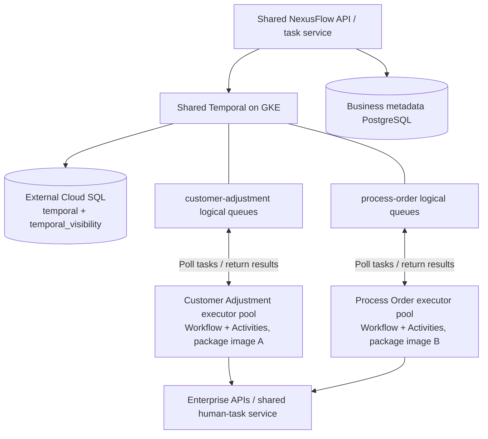

# ADR 0006: Workflow packages and generic executor pools

- Status: Accepted; local package/executor foundation implemented in Phase 4A
- Date: 2026-09-27
- Supersedes: ADR 0005 for future deployment and release ownership
- Preserves: ADR 0003 hosting direction and Phase 4 history compatibility

## Context

The original Phase 4 deploys a shared orchestration runtime and five independently
packaged capability workers. Typed envelopes correlate their executions but do
not bind a business workflow and its executable dependencies to one release.
The user requires each workflow to be independently deployable with its dependent
Activities, and generic worker replicas that can scale for that workflow's volume.
Phase 4A now implements the local package/executor foundation. The original
services remain available for existing histories; cloud deployment remains later
work. See [verification](../development/phase-4a-verification.md).

## Decision

The build, release, promotion, and deployment unit is a business workflow package.
Its immutable image contains the governed definition or Workflow code, the runtime
it uses, every executable Activity implementation it depends on, contract schemas,
and locked library dependencies. A validated manifest enumerates package identity,
release/Build ID, definition revision or digest, registered Workflow and Activity
names, Activity contract versions, allowed pool roles, queue bindings, runtime
compatibility, and long-running versioning behavior. Canonical manifest hashes
exclude their own hash fields. The installed content manifest is a build input;
a separate post-build release descriptor binds its hash and dependency-lock hash
to the artifact digest. Phase 4A can validate wheel/package artifact digests; Phase
9 adds the final OCI image digest to that descriptor. The final digest is not
embedded in the image's own manifest, avoiding circular self-digests. Secret values, endpoint addresses,
replica counts, and environment-specific namespace bindings remain runtime/deployment
configuration rather than immutable application content.

Implemented paths are `workflow-packages/customer-adjustment/` for the first
package, `apps/workflow-executor/` for the generic host, and `libs/activities/` for
reusable Activity implementations.
Shared Activity libraries are assembled into each consuming package at build time;
there is no mandatory separately released validation, notification, integration,
or human-task Activity-worker dependency.

The executor loads only the installed package at startup, validates its manifest
and bindings before becoming ready, and registers named handlers with the Temporal
SDK. It does not interpret task payloads as import paths or download code from a
definition registry. The executor owns polling, probes, telemetry, configuration,
and shutdown; business code remains in the package. Deterministic Workflow logic
and Activity I/O retain distinct SDK execution boundaries even in the same image.

## Topology and capacity

Task queues are Temporal logical resources, not extra queue servers. Executors
connect to Temporal Frontend and generally require no business-facing ingress.
The default package pool registers both Workflow and Activity handlers. Optional
Workflow-only and Activity-only pools use the same image, manifest, Build ID, and
Worker Deployment Version; separate queues require a documented resource,
permission, or workload reason. Queue names are stable per package/pool within an
environment's Temporal namespace, rather than renamed for every replica or release.
Definitions select allowed logical package bindings, not arbitrary queues supplied
by callers. Environment namespace, resolved queue names, and capacity can change
through approved deployment configuration; they do not rewrite immutable artifact
content. Each execution captures the approved concrete bindings needed for replay.

Each production serving queue begins with at least two executor replicas spread
across failure domains, including old release pools still needed by pinned work.
Replica limits, per-process Workflow/Activity task slots, poller configuration, and
CPU/memory are independent controls. Autoscaling per package, role pool, and active
release uses measured backlog/pickup latency together with available slots and
resources; waiting approvals or timers alone do not indicate executable load.
Kubernetes termination grace must allow the SDK drain period and shutdown overhead.

This structure applies Temporal's queue isolation and worker tuning guidance to
the user's package boundary; Temporal does not mandate one package per workflow
or one deployment per Activity. See [Workers](https://docs.temporal.io/best-practices/worker)
and [Task Queues](https://docs.temporal.io/task-queue).

## Releases and long-running executions

Each package has a logical Temporal Worker Deployment. Each immutable release
uses a distinct Build ID/Worker Deployment Version. New and old release pools can
coexist in blue-green/rainbow pools during ramping, promotion, rollback, and draining;
replacing all pods with
incompatible code is not the release strategy. Workflow and Activity pools of a
release participate in the same version so dependent Activity code follows the
workflow's deployment version. An exception using a separately deployed service
is an explicit external API contract, not an omitted executable package dependency.
See [Worker Versioning](https://docs.temporal.io/production-deployment/worker-deployments/worker-versioning)
and [Activity version routing](https://docs.temporal.io/worker-versioning).

Each workflow type must declare Temporal Pinned or Auto-Upgrade behavior and one
tested evolution policy:

- **Pinned**: retain its old serving release while executions still need it.
- **Auto-Upgrade**: allow new compatible code with replay-safe patching and tests.
- **Pinned with Continue-As-New upgrade**: explicitly opt into a release change at
  a supported, tested continuation boundary while preserving business state and
  accepted pending decisions. Pinned continuations otherwise inherit the old
  version; Continue-As-New is not a third Temporal Versioning Behavior.

Definition immutability does not prove code compatibility. Releases require
contract, integration, replay, rollout, and rollback evidence. A newer release may
support earlier exact definition revision/hash pairs in its declared compatibility
set, but it must validate their full handler/contract closure before serving or
upgrading those executions. Bundling only a new incompatible definition revision
does not authorize moving an execution that retains an older revision.

The business database transaction reserves intended package/release eligibility,
definition, manifest provenance, concrete queues/namespace, and versioning policy.
It is not an atomic transaction with Temporal's current/ramping routing. Where the
SDK supports an explicit initial version selection, validate that its semantics
preserve the declared upgrade policy. Otherwise distinguish the reserved routing
intent from Temporal's selected version and reconcile the confirmed initial
release/Build ID idempotently after submission, including uncertain responses.
All eligible current/ramping versions must support the exact selected definition
revision and complete closure. Pending recovery retains the original reservation
intent; it must not invent a confirmed version or silently choose incompatible
code. For Auto-Upgrade, initial provenance does not imply lifetime code pinning;
record approved version transitions separately. See [Safe deployments](https://docs.temporal.io/develop/safe-deployments).

For GKE, the [Temporal Worker Controller](https://docs.temporal.io/production-deployment/worker-deployments/kubernetes-controller)
is the preferred lifecycle manager for versioned pools; adopt it after confirming
a supported Server/SDK/controller combination. If compatibility is unavailable,
implement the same version-aware lifecycle explicitly; ordinary rolling Deployments
alone do not satisfy the requirement. No controller, autoscaling policy, or
production capacity has been validated in the current implementation. Deployment
APIs record desired capacity and release routing, while the reconciler reports
observed readiness, polling replicas, and errors. Storing desired state alone
does not establish a serving pool.

## Migration and consequences

Phase 4A implements manifest contracts, the generic host, reusable Activity
libraries, the Customer Adjustment package, API release binding, and acceptance
tests before the revised later stories depend on this layout. Phase 9 supplies
containers, Kubernetes/controller manifests, capacity configuration and cloud
validation; Phase 10 supplies immutable package build/promotion automation.

Existing `LightweightProcess`, `GovernedWorkflowV1`, their registrations, and
history-dependent queue names remain available for prior executions. Pending
reservations retain their original runtime profile and queue. Package starts are
a distinct explicit binding; migration does not rewrite histories, silently
redirect pending requests, or backfill unknown package releases. Legacy routing
can be retired only after compatibility evidence and an inventory demonstrate
that it is no longer required.

The tradeoff is duplicated shared library code in package images and potentially
several simultaneous release pools for long waits. In exchange, one artifact owns
the complete executable dependency set, scaling belongs to a business workflow,
and releases are reviewable without coordinating unrelated capability deployments.
Shared API, business database, persistent human-task service, and Temporal platform
remain independently operated infrastructure. No second durability engine is added.
