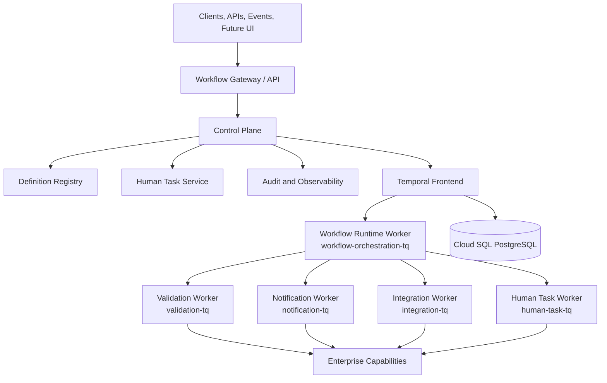

# Implementation Plan: Enterprise Workflow Platform

**Branch**: `001-enterprise-workflow-platform` | **Date**: 2026-09-26 | **Spec**: [spec.md](spec.md)

## Summary

Transform the single-process Temporal prototype into a governed platform while preserving the sample workflow. The implementation will introduce typed definition contracts, a registry and API control plane, a dedicated workflow-runtime worker, independent capability workers, a human-task service, enterprise audit/observability/security boundaries, and GKE/GCP delivery artifacts. Temporal remains the durable execution engine and is hidden behind the platform API.

## Technical Context

**Language/Version**: Python 3.11+

**Primary Dependencies**: Temporal Python SDK, typed validation/modeling library, HTTP API framework, OpenAPI tooling, pytest, static analysis, OpenTelemetry, PostgreSQL client/migration tooling

**Storage**: Temporal persistence in external Cloud SQL PostgreSQL databases `temporal` and `temporal_visibility`; control-plane and human-task persistence to be selected during Phase 0

**Testing**: pytest, Temporal test facilities/local Temporal environment, contract tests, integration tests, E2E tests, Helm lint/template, Terraform fmt/validate, YAML and secret scans

**Target Platform**: Linux containers on GKE; local development uses a local Temporal environment

**Project Type**: Multi-service workflow platform with independently deployable API, runtime, task, and Activity worker services

**Performance Goals**: Configurable by workflow criticality; queue pickup, start latency, throughput, workflow duration, history size, and resource targets require product baselines before production sizing

**Constraints**: Deterministic workflows, external I/O only in Activities, no permanent cloud keys, no bundled production PostgreSQL, immutable image promotion, graceful worker shutdown, backward-compatible long-running workflow deployments

**Scale/Scope**: Designed for multiple business domains, thousands of definitions, millions of executions, independently scalable worker pools, and future workload isolation; exact capacity requires load testing

## Constitution Check

- Temporal execution substrate: PASS. No custom execution engine is planned.
- Governed contracts: PASS. Definitions, Activities, APIs, tasks, and audit events are versioned contracts.
- Independent workers: PASS. Each worker has separate source, tests, image, Deployment, and Helm values.
- Deterministic workflows: PASS. External I/O is assigned to Activities.
- Testable delivery: PASS. Each user story has an independent acceptance path.
- Security/audit: PASS. Identity, secret references, redaction, audit, and telemetry are first-class.
- Operational recovery: PASS. Retry classification, compensation, remediation, graceful shutdown, and rollback are included.
- Simplicity: PASS with a documented exception for multiple services because worker independence is a stated requirement.

## Architecture



## Repository Structure

```text
.specify/
  memory/constitution.md
specs/001-enterprise-workflow-platform/
  spec.md
  research.md
  data-model.md
  plan.md
  tasks.md
  contracts/api.md
  quickstart.md
apps/
  workflow-api/
  workflow-runtime/
  human-task-service/
  workflow-admin/
workflows/
  common/
  definitions/
  examples/
workers/
  validation-worker/
  notification-worker/
  integration-worker/
  human-task-worker/
  sample-business-worker/
libs/
  workflow-sdk/
  contracts/
  observability/
  security/
  common/
platform/temporal/
deploy/helm/
infrastructure/terraform/
tests/
scripts/
docs/
```

## Delivery Phases

1. **Phase 0: Assessment and baseline**. Document current-to-target mapping, decide unresolved platform choices, establish packaging, and add behavior-preserving tests.
2. **Phase 1: Contracts and runtime foundation**. Add typed definitions, schema/graph validation, deterministic interpreter boundaries, runtime worker, and Temporal tests.
3. **Phase 2: Control plane**. Add registry, lifecycle, API, execution metadata, OpenAPI, idempotency, schedules, and event starters.
4. **Phase 3: Human tasks**. Add task service, worker, authorization, assignment lifecycle, escalation, evidence, and workflow resumption.
5. **Phase 4: Capability workers**. Extract demo capabilities into independently deployable workers and add adapter contracts/protection.
6. **Phase 5: Security and operations**. Add identity, secrets, tenant context, audit, telemetry, SLOs, dashboards, and runbooks.
7. **Phase 6: Containers and local delivery**. Add Dockerfiles, local dependencies, Make targets, and E2E validation.
8. **Phase 7: GCP/GKE delivery**. Add Terraform, Cloud SQL, Temporal Helm values, service charts, probes, HPAs, and graceful rollout.
9. **Phase 8: CI/CD**. Add PR checks, affected-image builds, scanning, WIF authentication, promotion, smoke tests, and rollback.
10. **Phase 9: Documentation and migration**. Add README, architecture docs, ADRs, release/versioning guidance, and Alfresco migration playbooks.

## Key Decisions Required Before Implementation

- Control-plane persistence technology and migration strategy.
- API framework and identity provider.
- Self-hosted Temporal on GKE versus managed Temporal hosting.
- Initial tenant/domain isolation model.
- Human-task form, evidence, delegation, SLA, and retention policy.
- Production SLO, throughput, RTO/RPO, payload, history, and audit retention targets.
- Alfresco process inventory and compatibility scope.

## Verification Strategy

- Unit tests for models, validation, routing, errors, idempotency, tasks, and audit.
- Temporal tests for timers, retries, timeouts, signals, approvals, cancellation, compensation, and version compatibility.
- Contract tests for API and every worker Activity.
- Integration tests using local Temporal and a test persistence environment.
- E2E test for the complete customer-adjustment flow.
- Static validation for images, Helm, Terraform, GitHub Actions, and secrets.
- Cloud validation when credentials exist; otherwise report exact unverified deployment commands.

## Complexity Tracking

| Complexity | Justification | Simpler Alternative Rejected Because |
|---|---|---|
| Multiple deployable worker services | Independent scaling, deployment, versioning, and failure isolation are explicit requirements. | One worker image would couple unrelated release and capacity decisions. |
| Control-plane metadata separate from Temporal history | Business audit and search have different retention, access, and query needs. | Exposing or copying full Temporal history would leak infrastructure details and increase storage/query cost. |
| Definition compiler/validator | Future visual authoring and safe versioning require a governed intermediate model. | Passing raw JSON directly to workflows is unsafe and not evolvable. |