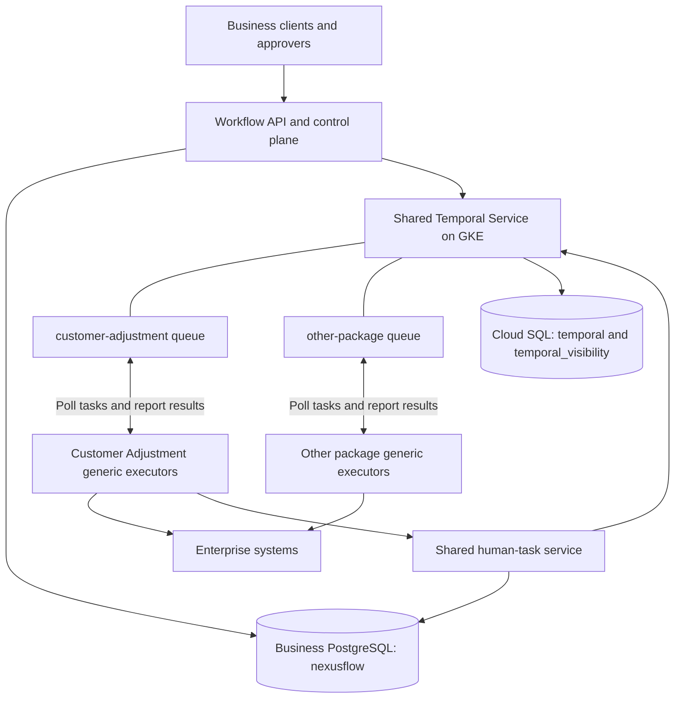

# Implementation Plan: Enterprise Workflow Platform

**Working Branch**: `codex/phase-4a-workflow-packages-generic-executors` (from `feature/develop`) | **Revised**: 2026-09-27 | **Spec**: [spec.md](spec.md)

## Status and scope

Phases 1–4 (T001–T031) are implemented under the original capability-service architecture. Phase 4 runs shared `GovernedWorkflowV1` orchestration and five separately packaged capability workers. Its 601-test verification remains evidence for that implementation, not for the revised topology.

The accepted target makes each business workflow package the unit of build, release, deployment, and capacity ownership. **Phase 4A, T078–T090, is implemented**: complete local artifacts, manifest validation, a generic executor, release-aware runtime/API routing, capacity configuration and migration/replay checks. Its full suite passed 802 tests; both packages passed isolated installation and real Temporal execution. See [verification evidence](../../docs/development/phase-4a-verification.md). Containers, controllers and cloud autoscaling remain later phases. [ADR 0006](../../docs/adr/0006-workflow-packages-and-executor-pools.md) supersedes ADR 0005's target ownership while preserving original code and histories. Existing task IDs and historical completion evidence remain unchanged.

## Summary

Build one immutable workflow package containing its exact governed definition revision or Workflow code, runtime dependency, all dependent executable Activity implementations, typed contracts, registration manifest, and locked dependencies. The embedded content manifest has a canonical hash; a separate immutable release descriptor records that hash and the final artifact digest after build, avoiding self-referential hashing. Phase 4A verifies local artifacts; Phase 9 adds the OCI image digest without changing their provenance. Generic executors load this installed package at startup and register explicit Workflow and Activity handlers. The default pool runs both handler types. Optional role pools use the same image/build where resources, permissions, or scaling warrant isolation.

The API, registry, human-task service, business audit/persistence, and Temporal remain shared platform services. Package-local Activities may call these services; their servers/databases are not embedded in packages. Reusable Activity code is a pinned library dependency. Complete packages do not require separately deployed Phase 4 capability workers to supply their executable handlers.

## Technical context

| Area | Direction |
| --- | --- |
| Language | Python 3.11+; current verification uses Python 3.12 |
| Dependencies | Temporal Python SDK 1.33.0, Pydantic 2, FastAPI, SQLAlchemy/Alembic/psycopg, pytest, Ruff, mypy; current versions remain locked in `uv.lock` |
| Packaging | Trusted installed manifest and locked dependency closure; immutable per-package image in Phase 9 |
| Business persistence | Separate PostgreSQL `nexusflow` for definitions, releases, reservations, tasks and audit; API repositories already exist |
| Temporal persistence | Self-hosted Temporal/GKE with external Cloud SQL `temporal` and `temporal_visibility`; production infrastructure is planned |
| Environments | Separate Temporal namespaces; package/pool queues and deployment configuration within each environment |
| Delivery | Versioned worker pools, reusable templates, Temporal Worker Controller, immutable promotion through environments |
| Capacity | Replicas and per-process task slots are distinct; pickup latency, backlog, slots, resources and downstream limits guide sizing |
| Verification | Manifest/closure, unit, contract, real Temporal, replay, migration, multi-replica, image, Helm/controller, Terraform and CI checks |

The current SDK meets Temporal's published Python minimum for modern Worker Versioning. Local verification used SDK 1.33.0, CLI 1.9.1 and Server 1.32.0. Production Server/CLI/UI/Worker Controller versions must be selected and verified together before infrastructure deployment. Local CLI compatibility does not establish production compatibility.

## Constitution check

- Temporal substrate: retained. Temporal owns durability, retries, timers, history and matching; no custom task scheduler/dispatcher.
- Governed contracts: retained and extended with package manifests, releases and executor pools.
- Package ownership: constitution 1.1.0 permits related Workflow and Activity code together; unrelated packages remain independent.
- Generic executors: explicit installed registrations, owned queues, capacity configuration and unique instance identities.
- Determinism: Workflow code contains no external I/O even when Activities share its image/process.
- Safe releases: version routing, per-type lifetime policies, replay evidence and legacy compatibility.
- Simplicity: combined pool by default; additional pools need a resource/security/scaling reason.

The local package/runtime/executor checks pass in Phase 4A. Image, controller,
autoscaling and cloud conformance remain unverified until their later phases pass.

## Deployment topology



Queues are logical resources in the environment's Temporal namespace. Executors connect to Temporal Frontend; the API does not load-balance business requests directly to them. Application executors are distinct from Temporal's internal worker service. Metrics/probes can be exposed internally; polling needs no business ingress.

### Package and release boundaries

- `WorkflowPackage`: workload identity and declared Workflow/Activity handler closure.
- `WorkflowRelease`: immutable content-manifest hash and post-build artifact digest, exact definition/code, runtime and Activity implementations/contracts, dependency locks and compatibility policy; the image digest is added after the Phase 9 image build.
- `ExecutorPool`: release, environment, role, approved queues, replicas/capacity, service identity and operational configuration.
- Definitions remain independently authored/governed, but each release selects exact immutable revisions. Definition promotion alone cannot silently change executable dependencies or routing. An upgrade candidate must include and support the running workflow's original revision and its full handler closure; compatible revision hashes are explicit release metadata. Otherwise that execution stays on its old version.
- Entrypoints are validated before polling. Executors do not download arbitrary task code or restore the legacy `execute_capability` switch.

### Execution layouts and routing

| Layout | Registration | Capacity/routing |
| --- | --- | --- |
| Default combined pool | Workflow and all package-owned Activities | Stable queue name with distinct Workflow/Activity task types; independent package replicas and task slots |
| Optional role pools | Workflow-only and Activity-only, same image/build | Stable role queues, all members of the same Worker Deployment Version; separate role sizing |

Replicas consuming a given task type on a queue register the same compatible handlers for their routed version. Use environment namespaces and workload/pool queues, not a namespace per definition or queue per execution. Resolve approved bindings outside Workflow code and record them in immutable release/execution inputs; replay never reads mutable deployment configuration.

### Capacity and shutdown

Expose replicas, minimum/maximum replicas, Workflow/Activity slots, supported poller tuning, CPU/memory, downstream rate limits, and shutdown grace in validated configuration. Production serving queues start with at least two polling replicas spread across failure domains; final capacity needs measurements. Local development can use one. Scale using pickup latency/backlog, slots, resource usage, and connection/downstream metrics together. Open workflow count alone is insufficient: human waits and timers do not reserve executor threads for their duration.

Desired pool configuration is not observed readiness. Store reconciliation generation, observed replicas/Build IDs, dependency health and failure state separately; release admission uses confirmed serving state rather than a configuration write.

Give every instance a unique identity correlated with package/build/pool. Drop readiness before draining; allow Kubernetes termination time for SDK shutdown and cleanup. Grace does not guarantee every long Activity finishes; use cooperative cancellation/heartbeats where appropriate and idempotent side effects. Scale-to-zero is not the production default and needs a reliable external wake-up mechanism.

### Version-aware rollout

Use a stable Temporal Worker Deployment name per package and immutable Build ID per release. Multiple Kubernetes release pools coexist behind stable logical queues, with Temporal routing tasks to compatible versions. In-place replacement alone is insufficient for pinned executions.

The database transaction freezes the intended release and bounded eligible routing policy, not a distributed atomic commit with Temporal. Use a supported initial-version routing primitive only where it preserves the declared behavior; otherwise reconcile Temporal's actual initial version before reporting confirmed release provenance. Current/ramping candidates must all support the selected exact definition revision and handler closure. Retry an uncertain submission by stable execution identity and reconcile the existing run, never re-resolve its business revision or pretend a preselected Build ID was confirmed. If a pending start can no longer be routed within its recorded eligibility, retain compatible capacity or report unavailable; do not silently admit an incompatible newly promoted build.

Declare versioning behavior per Workflow type. Short runs may be Pinned and retain their version until completion. Longer workflows choose Pinned with a supported explicit upgrade at a suitable Continue-As-New boundary, or Auto-Upgrade with patching/replay compatibility. Continue-As-New does not automatically unpin a run. Approval migration must preserve signal, task, schema and Activity compatibility.

Phase 4A supports Pinned and compatible AutoUpgrade execution with inherited
completed-step continuation. It rejects explicit Pinned Continue-As-New upgrade
requests; approved override removal and advanced upgrade/remediation remain T044.

Package Activity queues belong to the same Worker Deployment Version to preserve release correlation. Unrelated Activity deployments are independent dependencies outside the default complete-package guarantee; shared HTTP/database services remain external operational dependencies.

Temporal Worker Controller is the preferred target for Kubernetes release lifecycle and per-version autoscaling; adopt it after compatibility verification. If the supported production combination cannot use it, document and verify an equivalent version-aware lifecycle adapter rather than claiming ordinary rolling replacement is sufficient. Controller resources own release Deployments; avoid conflicting manual Deployment/HPA ownership. Retire versions only after drainage checks and the retained-query/support policy. Business projections remain accessible independently of Temporal retention.

## Implementation structure and later planning paths

The package/API/runtime paths are implemented. Comments identify later services
and deployment artifacts that remain planning paths:

```text
apps/
  workflow-api/                 # governed API and package release/pool control plane
  workflow-executor/            # generic installed-package process host
  human-task-service/           # planned shared durable task service
  workflow-admin/               # planned
workflow-packages/
  customer-adjustment/          # manifest, definition/code, locked dependencies
libs/
  contracts/                    # package/release/pool contracts
  workflow-sdk/                 # reusable runtime, manifest/graph validation
  activities/                   # reusable named package-local Activity code
  common/                       # configuration, lifecycle, capacity
  observability/                # planned
  security/                     # planned
workflows/common/               # existing pure semantics retained/reused
tests/fixtures/workflow-packages/validation-reference/
deploy/helm/workflow-executor/   # planned package/pool/controller templates
platform/temporal/              # planned
infrastructure/terraform/       # planned
scripts/
docs/
```

Preserve `app/`, `apps/workflow-runtime/`, `workers/*-worker/`, and version 1 catalogue bindings during migration. Extract reusable code without changing historical names, queues or replay commands. New package execution uses a new compatible runtime/profile and release binding; never silently redirect existing `GovernedWorkflowV1` histories.

## Delivery phases and dependencies

[`tasks.md`](tasks.md) is the sole numbering authority:

| Phase | Tasks | Status / outcome |
| --- | --- | --- |
| 1: Setup | T001–T006 | Complete; baseline/tooling |
| 2: Foundational Contracts | T007–T014 | Complete; typed contracts/pure semantics |
| 3: Governed Workflow API | T015–T021 | Complete; API/registry/persistence |
| 4: Original Runtime and Independent Workers | T022–T031 | Complete under superseded capability deployment model |
| 4A: Workflow Packages and Generic Executors | T078–T090 | Complete locally; closure, host, bindings, capacity, version routing and migration; 802 tests |
| 5: Human Task Management | T032–T038 | Package handlers calling shared durable task service |
| 6: Failure Handling and Operations | T039–T044 | Side-effect safety, remediation, long-running/history policy |
| 7: Definition and Release Governance | T045–T048 | Definition/release compatibility, approval and promotion |
| 8: Security, Audit, Observability | T049–T055 | Scoped operations and release/pool telemetry |
| 9: Containers, GKE, Cloud SQL | T056–T065 | Images, controller/pools, configured autoscaling and shared infrastructure |
| 10: CI/CD and Release Promotion | T066–T072 | Transitive affected-package builds and immutable version-aware promotion |
| 11: Documentation and Migration | T073–T077 | Architecture/runbooks/migration/final evidence |

Phase 4A establishes interfaces before later runtime integration. Task persistence and infrastructure design can proceed independently; package deployment integration depends on 4A. Local trusted-package execution is verified first. Production image/controller/autoscaler/GKE checks remain Phase 9; CI promotion is Phase 10. Original test counts cannot substitute for new acceptance evidence.

## Verification strategy

- Reject missing handlers, incompatible contracts, unapproved entrypoints, mutable dependencies and invalid bindings before polling/promotion; prove closure in clean installed environments without other workers or aggregate-root imports.
- Test all sample dependencies in package executors, a second package's outage isolation, multiple replicas, role pools, slot limits, replica changes and graceful draining.
- Verify private immutable bindings survive duplicate starts, uncertain submission, promotions and rollback; clients cannot override queue/build/pool/actor/entrypoints.
- Exercise real Temporal retries/timeouts/cancellation, approvals/timers, restart/replay, version-aware Activities, ramping and safe migration; preserve replay of original histories.
- Verify locked images, controller versions, per-version autoscaling, probes, resources/permissions, Helm rendering/lint, Terraform and CI. Repository imports alone do not prove deployable closure.
- Execute authorized load/failover/cloud exercises and record measured SLO/RTO/RPO evidence. Static checks do not prove cloud capacity.

## Outstanding production inputs

- OIDC issuer/audience/claim mapping and package service-access policy.
- Production Temporal/CLI/UI/Worker Controller versions and upgrade verification.
- Workload throughput, latency, resource/downstream capacity and autoscaling targets.
- Per-type maximum duration/versioning behavior, history/Continue-As-New thresholds and old-release retention/query policy.
- Human-task forms/evidence/SLA/retention, payload classification/encryption, tenant isolation and Alfresco parity.

## Decisions and Temporal guidance

- [ADR 0001](../../docs/adr/0001-foundational-contracts.md): typed definitions and pure semantics.
- [ADR 0002](../../docs/adr/0002-control-plane-and-identity.md): business persistence and identity.
- [ADR 0003](../../docs/adr/0003-temporal-hosting-and-operating-limits.md): GKE and external Cloud SQL.
- [ADR 0005](../../docs/adr/0005-runtime-and-worker-ownership.md): retained original Phase 4 history.
- [ADR 0006](../../docs/adr/0006-workflow-packages-and-executor-pools.md): accepted package/executor target.
- [Worker practices](https://docs.temporal.io/best-practices/worker) and [task queues](https://docs.temporal.io/task-queue): workload ownership, compatible handlers and serving replicas.
- [Worker Versioning](https://docs.temporal.io/production-deployment/worker-deployments/worker-versioning) and [Activity behavior](https://docs.temporal.io/worker-versioning): lifetime policies and executable release correlation.
- [Safe deployments](https://docs.temporal.io/develop/safe-deployments): deterministic changes and replay.
- [Worker Controller](https://docs.temporal.io/production-deployment/worker-deployments/kubernetes-controller): Kubernetes version lifecycle and autoscaling.

## Complexity and tradeoffs

| Choice | Reason | Tradeoff |
| --- | --- | --- |
| Per-workflow package image | Reproducible Workflow/Activity ownership | Shared dependencies can be duplicated; changes rebuild all affected packages |
| Combined pool by default | Simple workload ownership | Resources/permissions coupled; role pools address measured needs |
| Concurrent release pools | Keep running work compatible while releasing new code | Pinned waits retain old compute/code; explicit lifetime policy bounds cost |
| Shared platform services | Avoid copying task/database/Temporal infrastructure | Shared capacity/availability remain operational dependencies |
| Separate definition/release governance | Independent authoring with exact deployed closure | Promotion must validate both definition and compatible package release |
